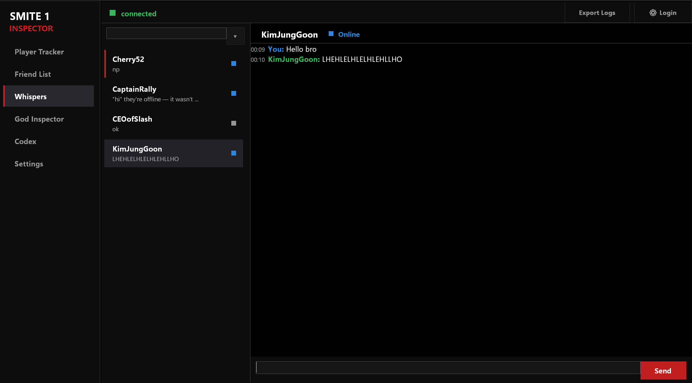
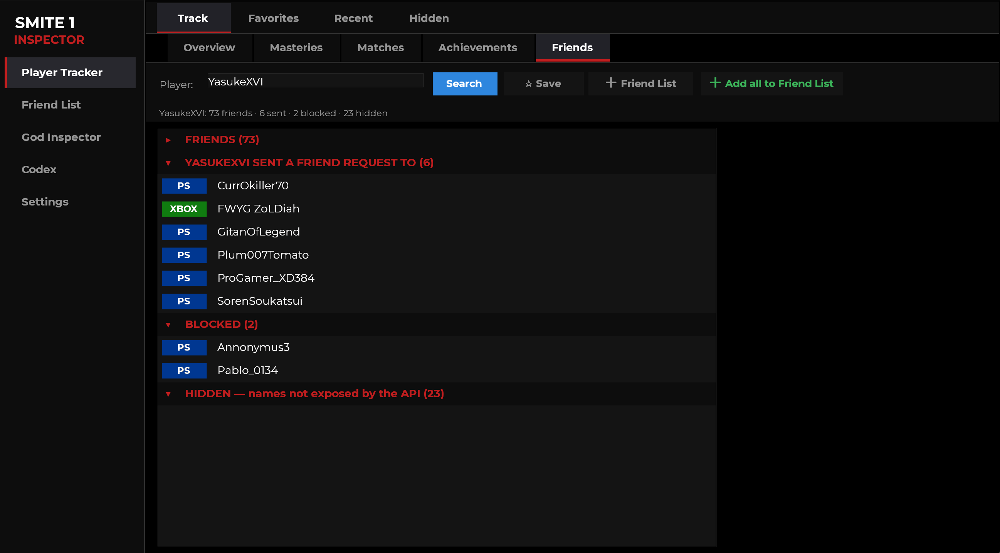
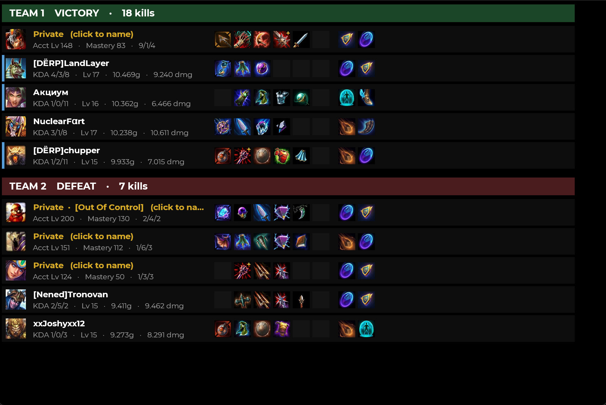
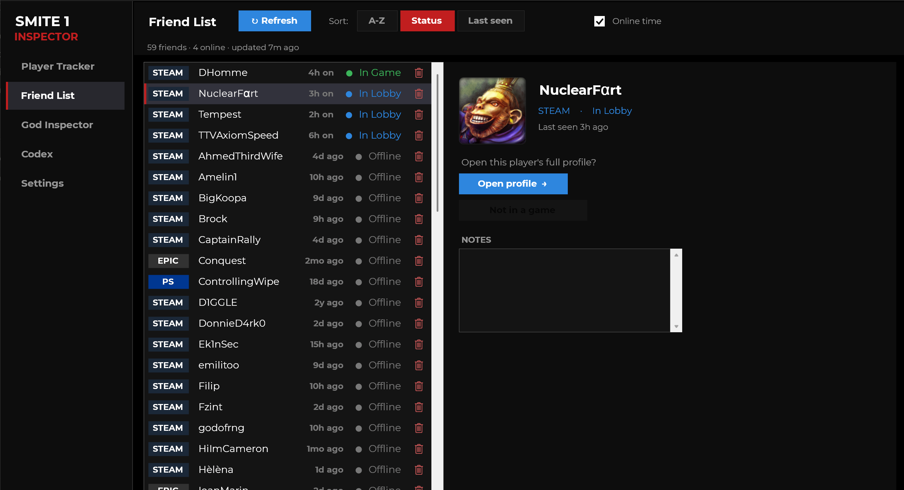
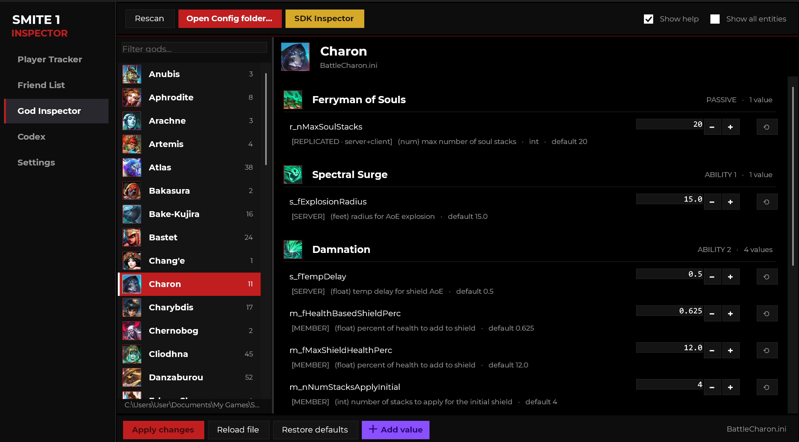

# SMITE 1 Inspector

A native Windows desktop app (C# / WinForms, .NET 8) for **SMITE 1**. It combines a live player/friend tracker built on the official Hi-Rez API, an offline editor for the game's god ability-tuning files, and **Whispers** — a standalone messenger that messages live players with the game completely closed. Installs in one click — no admin prompt — and keeps itself up to date.

> SMITE 1 is in maintenance mode, but its servers and stats API are still up. This is an unofficial fan tool, see **Disclaimer** below.

## Screenshots

Whispers — message live players with the game closed; messages send as in-game whispers and replies arrive in real time:



Player Tracker, showing a player's friends, sent requests, and blocked and hidden entries:



A match scoreboard with each player's god, build, KDA and premade-party bars (privacy-flagged players still show their stats and can be nicknamed with a click):



The live Friend List with status, online uptime, and a per-friend preview panel with notes:



The God Inspector editing a god's ability tuning values:



## Features

### Player Tracker

- **Search any player** by name (partial or full, case-insensitive). If several accounts share a name you get a disambiguation picker.
- **Profile card**: level, total mastery, region, platform, win/loss and win rate, worshippers, hours played, ranked tiers, account created and last login, and career achievements. The name row shows the in-game name with a SMITE coin plus a platform coin (Steam, Xbox, Epic, Switch) and any linked accounts.
- **God Masteries**: every god you've played with rank, worshippers, KDA, win rate and minion kills. Double-click a god for a per-queue breakdown.
- **Recent Matches**: your latest games with god, queue, result, KDA, level, damage and gold. Double-click a match for the full scoreboard.
- **Match scoreboards**: both teams with each player's god, build (items and relics), KDA and stats, and colored bars marking premade parties.
- **Achievements**: a full grid of career stats (multi-kills, spree types, objective kills, and more).
- **Friends**: a player's Hi-Rez friends, plus incoming and outgoing friend requests and blocked entries, decoded from the friend flags.
- **Live match reveal**: when a tracked player is in a game, jump straight to the in-progress scoreboard, which shows names that a completed match would hide.
- **Favorites** and **Recent lookups** for quick re-access.

### Friend List

Your own curated buddy list with continuous, live status.

- Updates **continuously in the background** with a **priority poller** instead of re-scanning on every visit: god-select refreshes fastest (10s), then online (15s), then in-game (20s). Offline friends back off the longer they've been gone (up to about 10 minutes, around 20 minutes after a year) and snap back the moment they come online.
- Status checks run **in parallel** so the list fills fast, with a live "updated Xs ago" readout. Leaving the tab caches the list; returning shows it instantly and resumes by priority.
- **Sort** by name, status, or last seen. Toggle **online uptime** to see how long online friends have been logged in.
- **Preview panel** per friend: in-game avatar (or a colored initial when none is set), platform, status, last seen, an Open-profile button, a View-current-game button when they're in a match, and a **private Notes** box.
- Self-throttles to stay well under the API's daily request limit.

### Whispers

Message live SMITE players while the game is completely **closed**. Whispers connects to SMITE's own chat service — the same backend the in-game whisper window uses — so your messages arrive as ordinary in-game whispers and replies appear here in real time.

- **No SMITE install required** — the networking components it needs are bundled with the app.
- **Steam or Hi-Rez login** — sign in with your running Steam session, or with your Hi-Rez account name and password directly (which avoids showing "playing SMITE" on Steam). Saved passwords are encrypted with Windows' own per-user encryption (DPAPI) and are never stored in plain text.
- **Instant offline feedback** (like in-game), **queued messages** you can cancel before they send, and a searchable **friend picker**.
- **Pin** and **soft-delete** conversations — deleting keeps the history and restores it the moment that person messages you again.
- **Presence** — see who's online without launching the game.
- **Export Logs** — a one-click diagnostics zip for troubleshooting, which never includes your password or saved conversation history.

> The SMITE game must be **closed** while you whisper (one account can't be signed in to chat twice). See **Whispers requirements** under [Install](#install).

### Hidden players

The privacy flag hides a player's name and ids, but a match row still leaks their clan, level, total mastery, gods played, and premade party-mates.

- **Nickname** a privacy-flagged player and the app **re-recognizes them** next time from a weighted fingerprint (clan, level, mastery, shared party-mates, gods), with a **confidence score**.
- A dedicated **Hidden tab** lists everyone you've nicknamed.
- Tag hidden players from a completed scoreboard or straight from a live game.
- This is best-effort recognition of a player you named yourself, never recovery of a hidden name from the API (which is not possible).

### God Inspector

- Loads every god's `Battle<God>.ini` from your SMITE config folder and turns each ability tunable (scaling, cooldowns, costs, radii, and so on) into an editable row, grouped by ability.
- **Edit, Apply, Reload, or Restore Defaults**. On first load it snapshots the pristine value of every key per file, so a restore is always possible even after you save; a timestamped backup is written on each Apply.
- Add new keys from the embedded UE3 **SDK definition list**. Engine and system files are hidden unless you enable "Show all entities". Ability icons and names come from a bundled media-kit asset pipeline.

### Codex

An in-depth, in-app guide to every feature and how it works, with an expandable contents sidebar and the actual math behind the hidden-player matcher and the friend-list scheduling.

### Settings

Choose the startup tab and time format, opt in to **beta** (pre-release) updates, clear saved data (recents, favorites, hidden tags, friend list), or **uninstall** the app (optionally erasing your saved data).

## Install

Download **`SmiteInspector-Setup-x.y.z.exe`** from the latest [Release](../../releases) and run it. It installs **in one click — no admin prompt** (it installs just for your Windows user), creates a desktop shortcut, launches itself, and keeps itself up to date automatically. The WebView2 runtime is installed if it's missing. (Windows SmartScreen may warn on first run since the app is unsigned — click *More info → Run anyway*.)

The installer is the only build, because Whispers needs the bundled chat engine that ships inside it.

### Whispers requirements

The stats tools (Player Tracker, Friend List, God Inspector, Codex) need only an internet connection. **Whispers** additionally needs:

- The SMITE game **closed** while you whisper (one account can't be signed in to chat twice).
- **Steam** running and signed in to your SMITE account — *or* the in-app **Hi-Rez login** (Whispers → Options).
- **No separate SMITE installation** — the networking components Whispers uses are bundled with the app.

## Build

You need the [.NET 8 SDK](https://dotnet.microsoft.com/download/dotnet/8.0). In the repo folder:

```
dotnet run                                  # run while developing
```

For a single portable, self-contained exe (no .NET install needed to run it):

```
dotnet publish -c Release -r win-x64 --self-contained true ^
  -p:PublishSingleFile=true -p:IncludeNativeLibrariesForSelfExtract=true
```

The result is `bin\Release\net8.0-windows\win-x64\publish\SmiteInspector.exe`. `build.bat` runs the same publish. The packaged installer is attached to each [Release](../../releases). (Whispers also needs its chat engine in a `whisper\` folder next to the exe; the installer bundles it — a bare `dotnet publish` does not.)

## API key (Player Tracker)

The tracker calls the official Hi-Rez SMITE 1 API, which needs a developer `devId` + `authKey`. The app ships with a working default key so it runs out of the box, but it is **rate-limited and shared**, so please use your **own** free key for anything serious.

Request one from Hi-Rez, then create a file named **`api.txt`** containing one line:

```
yourDevId,yourAuthKey
```

Put it next to the exe, or in `Documents\Smite Inspector\`. The app prefers `api.txt` over the built-in default. (`api.txt` is git-ignored.)

## Where data lives

All your data (favorites, friend list and per-friend notes, recents, settings, hidden-player nicknames, your Whispers conversations, and god default snapshots) is stored as plain JSON in `Documents\Smite Inspector\`, so a shared copy of the app in a read-only folder still works. Nothing is uploaded anywhere; the only network traffic is to the Hi-Rez API and SMITE's chat service, and only when you ask.

## Disclaimer

This is an **unofficial, fan-made** tool. It is not affiliated with, endorsed by, or sponsored by Hi-Rez Studios / Titan Forge Games. **SMITE**, its god/item artwork, and related marks are property of Hi-Rez Studios; platform logos (Steam, Xbox, Epic, Nintendo Switch) belong to their respective owners. They are included here solely to identify the in-game content the tool displays.

## License

[GPL-3.0](LICENSE).
